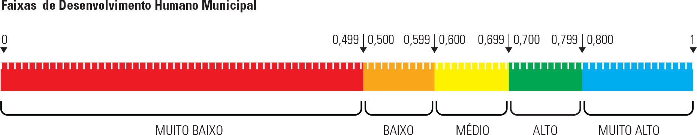

# FIOCRUZ - ICICT - PCDaS
# Aprendizagem de máquina supervisionada


# Biblioteca de machine learning

Bibliotecas utilizadas neste exemplo. É necessário instalar cada uma delas para que todas as funções sejam executadas corretamente.

```{r}
library("rpart")
library("rpart.plot")
library("AppliedPredictiveModeling")
library("caret")
library("e1071")
```


# Etapa 1: Leitura da base de dados

Vamos trabalhar com os dados do PNUD, utilizando algumas variáveis selecionadas. No objeto campos, inclua as variáveis *T_ATRASO_2_MED*, *T_FBBAS*, *T_FBFUND*.

```{r}
# Lê base de dados CSV
base <- read.csv("atlas2013_dadosbrutos_pt.csv", sep = ";", dec = ",")

# Campos escolhidos
campos <- c("IDHM", "ESPVIDA","FECTOT","MORT1","MORT5","RAZDEP","SOBRE40","SOBRE60","T_ENV","E_ANOSESTUDO","T_ATRASO_0_BASICO", ___, ___, ___)

# Filtra campos escolhidos
base <- base[, campos]

# Gera gráfico
boxplot(x = base)  
```


# Dicionário de dados:
* ESPVIDA - Esperança de vida ao nascer
* FECTOT - Taxa de fecundidade total
* MORT1 - Mortalidade infantil
* MORT5 - Mortalidade até 5 anos de idade
* RAZDEP - Razão de dependência
* SOBRE40 - Probabilidade de sobrevivência até 40 anos
* SOBRE60 - Probabilidade de sobrevivência até 60 anos
* T_ENV - Taxa de envelhecimento
* E_ANOSESTUDO - Expectativa de anos de estudo
* T_ANALF11A14 - Taxa de analfabetismo - 11 a 14 anos
* T_ANALF15A17 - Taxa de analfabetismo - 15 a 17 anos
* T_ANALF15M - Taxa de analfabetismo - 15 anos ou mais
* T_ANALF18A24 - Taxa de analfabetismo - 18 a 24 anos
* T_ANALF18M - Taxa de analfabetismo - 18 anos ou mais
* T_ANALF25A29 - Taxa de analfabetismo - 25 a 29 anos
* T_ANALF25M - Taxa de analfabetismo - 25 anos ou mais
* T_ATRASO_0_BASICO - % de 6 a 17 anos no básico sem atraso
* T_ATRASO_0_FUND - % de 6 a 14 anos no fundamental sem atraso
* T_ATRASO_0_MED - % de 15 a 17 anos no médio sem atraso
* T_ATRASO_1_BASICO - % de 6 a 17 no básico com 1 ano de atraso
* T_ATRASO_1_FUND - % de 6 a 14 anos no fundamental com 1 ano de atraso
* T_ATRASO_1_MED - % de 15 a 17 no médio com 1 ano de atraso
* T_ATRASO_2_BASICO - % de 6 a 17 anos no básico com 2 anos ou mais de atraso
* T_ATRASO_2_FUND - % de 6 a 14 anos no fundamental com 2 anos ou mais de atraso
* T_ATRASO_2_MED - % de 15 a 17 anos no médio com 2 anos de atraso
* T_FBBAS - Taxa de frequência bruta ao básico
* T_FBFUND - Taxa de frequência bruta ao fundamental
* T_FBMED - Taxa de frequência bruta ao médio
* T_FBPRE - Taxa de frequência bruta à pré-escola
* T_FBSUPER - Taxa de frequência bruta ao superior
* T_FLBAS - Taxa de frequência líquida ao básico
* T_FLFUND - Taxa de frequência líquida ao fundamental

# Etapa 2: Ordem aleatória da base de dados 
```{r}
linhas <- sample(nrow(base))
base <- base[linhas, ]
```

# Etapa 3: Cria variável dicotômica para tarefa de classificação

```{r}
base$idh.muito_b<-0
base$idh.muito_b[base$IDHM<0.5]<-1
base$idh.muito_b<-as.factor(base$idh.muito_b)
base$IDHM <- NULL
```



# Etapa 4: conjuntos de treino e teste

Agora que seu conjunto de dados é ordenado aleatoriamente, precisamos dividir o conjunto em treino e teste. Abaixo, temos um exemplo com o conjunto de treino com 90 porcento dos registros. *Mude o valor para 80 porcento*.

```{r}
# Posição de corte
corte <- round(nrow(base) * .90)

# Realiza o corte
treino<-base[1:corte,]
teste<-base[(corte + 1): nrow (base),]
```


# Etapa 5: treinando o algoritmo

Vamos treinar uma árvore de decisão utilizando a função *rpart* com as variáveis selecionadas. Lembre-se que a variável de resposta é a *idh.muito_b*.

```{r}


modelo.treino <- rpart(idh.muito_b ~ ESPVIDA + FECTOT + MORT1 + MORT5 + RAZDEP + SOBRE40 + SOBRE60 + T_ENV + E_ANOSESTUDO + T_ATRASO_0_BASICO + T_ATRASO_2_MED + T_FBBAS + T_FBFUND,
                       method="class", data=treino)
modelo.treino

```


Como ficou a árvore de decisão?

```{r}
rpart.plot(modelo.treino, type = 0, extra=102, main="Treino")

```


# Etapa 6: validação do algoritmo

A função *predict()* serve para fazer previsões desse modelo em novos dados. O novo conjunto de dados deve ter todas as colunas dos dados de treinamento, mas eles podem estar em uma ordem diferente com valores diferentes. 

Aqui, ao invés de re-predizer no conjunto de treinamento, você pode prever no conjunto de teste, que você não usou para treinar o modelo. Isso permitirá que você *determine o erro fora da amostra* para o modelo no próximo exercício.

```{r}
p.teste <- predict(modelo.treino, newdata = teste)
head(p.teste)
```


## Matriz de confusão

```{r}

tmp<-as.data.frame(p.teste[,1])
names(tmp)<-c("prob_y")
tmp$posicao<-row.names(tmp)

teste$var_prevista<-NA
teste[tmp[tmp$prob_y>0.5,"posicao"],"var_prevista"]<-FALSE
teste[tmp[tmp$prob_y<=.5,"posicao"],"var_prevista"]<-TRUE
summary(teste$var_prevista)
```


```{r}
a<-length(teste[teste$var_prevista==TRUE & teste$idh.muito_b == 1,1]);
b<-length(teste[teste$var_prevista==FALSE & teste$idh.muito_b == 1,1]);
c<-length(teste[teste$var_prevista==TRUE & teste$idh.muito_b == 0,1]);
d<-length(teste[teste$var_prevista==FALSE & teste$idh.muito_b == 0,1]);

tabconti <- matrix(data = c(a,b,c,d), 2, 2, byrow = TRUE);
rownames(tabconti) <- c("IDH Observado [Muito baixo]","IDH Observado [Médio ou Superior]");
colnames(tabconti)<-c("IDH Previsto [Muito baixo]","IDH Previsto [Médio ou Superior]");

tabconti
```


## Métricas

### Acurácia

A proporção de predições corretas, sem levar em consideração o que é positivo e o que é negativo. Esta medida é altamente suscetivel a desbalanceamentos do conjunto de dados e pode facilmente induzir a uma conclusão errada sobre o desempenho do sistema.

ACURACIA = TOTAL DE ACERTOS / TOTAL DE DADOS NO CONJUNTO

```{r}

ACURACIA <- (a + d) / (a+b+c+d)
ACURACIA

```


### Sensibilidade

A proporção de verdadeiros positivos: a capacidade do sistema em predizer corretamente a condição para casos que realmente a têm.

SENSIBILIDADE = ACERTOS POSITIVOS / TOTAL DE POSITIVOS

```{r}

SENSIBILIDADE = a / (a + c)
SENSIBILIDADE

```


### Especificidade

A proporção de verdadeiros negativos: a capacidade do sistema em predizer corretamente a ausência da condição para casos que realmente não a têm.
ESPECIFICIDADE = ACERTOS NEGATIVOS / TOTAL DE NEGATIVOS

```{r}

ESPECIFICIDADE <- d / (d + b)
ESPECIFICIDADE

```


### Eficiência

A média aritmética da Sensibilidade e Especificidade. Na prática, a sensibilidade e a especificidade variam em direções opostas. Isto é, geralmente, quando um método é muito sensível a positivos, tende a gerar muitos falso-positivos, e vice-versa. Assim, um método de decisão perfeito (100 % de sensibilidade e 100% especificidade) raramente é alcançado, e um balanço entre ambos deve ser atingido.


```{r}

EFICIENCIA = (SENSIBILIDADE + ESPECIFICIDADE) / 2
EFICIENCIA

```


# Referências:
  
ZHU, W.; ZENG, N.; WANG, N. NESUG 2010 Health Care and Life Sciences Sensitivity , Specificity , Accuracy , Associated Confidence Interval and ROC Analysis with Practical SAS. Life Sciences, p. 1-9, 2010.
PARK, S. H. Receiver Operating Characteristic ( ROC ) Curve : Practical Review. Korean Journal Of Radiology, v. 5, n. March, 2004.


# Usando a biblioteca *caret* em outras etapas

```{r}

TrainData <- teste[,c(1:14)];
names(teste)
levels(teste$idh.muito_b)<-c("IDH baixo ou superior", "IDH muito baixo");

TrainClasses<-as.factor(teste[,"idh.muito_b"]);


transparentTheme(trans = .4)
names(teste)  
caret::featurePlot(x = TrainData[,c("T_ATRASO_0_BASICO","ESPVIDA","T_FBBAS", "MORT1", "RAZDEP","SOBRE40")], 
              y = TrainClasses, 
              plot = "ellipse",
              #plot = "pairs",
            ## Add a key at the top 
            auto.key = list(columns = 2));


```

## Método de classificação [k-Nearest Neighbors]  

### Quando usamos o algoritmo KNN?
  
  O KNN pode ser usado para problemas de classificação e de regressão. No entanto, é mais amplamente utilizado em problemas de classificação na indústria. Para avaliar qualquer técnica geralmente olhamos para 3 aspectos importantes:
  
* 1. Facilidade para interpretar a saída

* 2. Tempo de cálculo

* 3. Poder Preditivo

Hipótese : Que dados similares tendem a estar concentrados na mesma região do espaço de dispersão dos dados.


```{r}
knnFit <- train(TrainData, TrainClasses,
                method = "knn",metric = "Accuracy",
                trControl = trainControl(method = "cv"));

plot(knnFit)

knnFit

confusionMatrix(knnFit)
```

### Como escolhemos o fator K?
  
Primeiro, vamos tentar entender o que exatamente influencia K no algoritmo. 
Se olharmos o último exemplo, uma vez que toda a observação de treinamento permanece constante, 
com um determinado valor de K podemos fazer fronteiras de cada classe.

### Vantagem da validação cruzada?

Ele fornece múltiplas estimativas de erro fora da amostra, em vez de uma única estimativa.

Mais informações: https://topepo.github.io/caret/index.html

